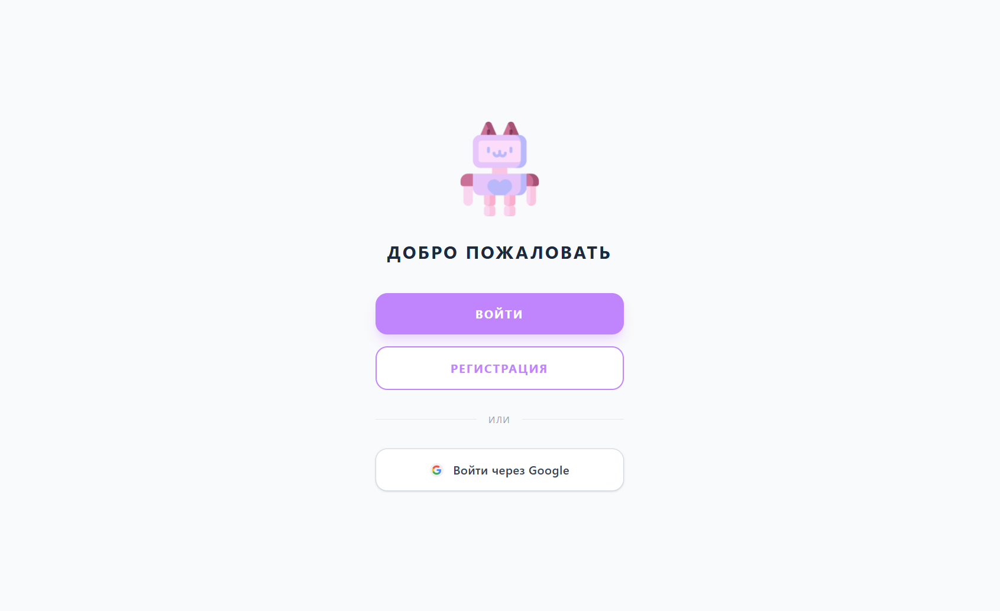
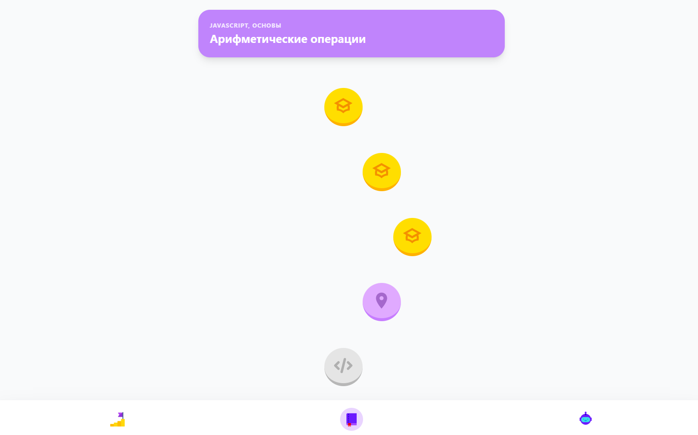
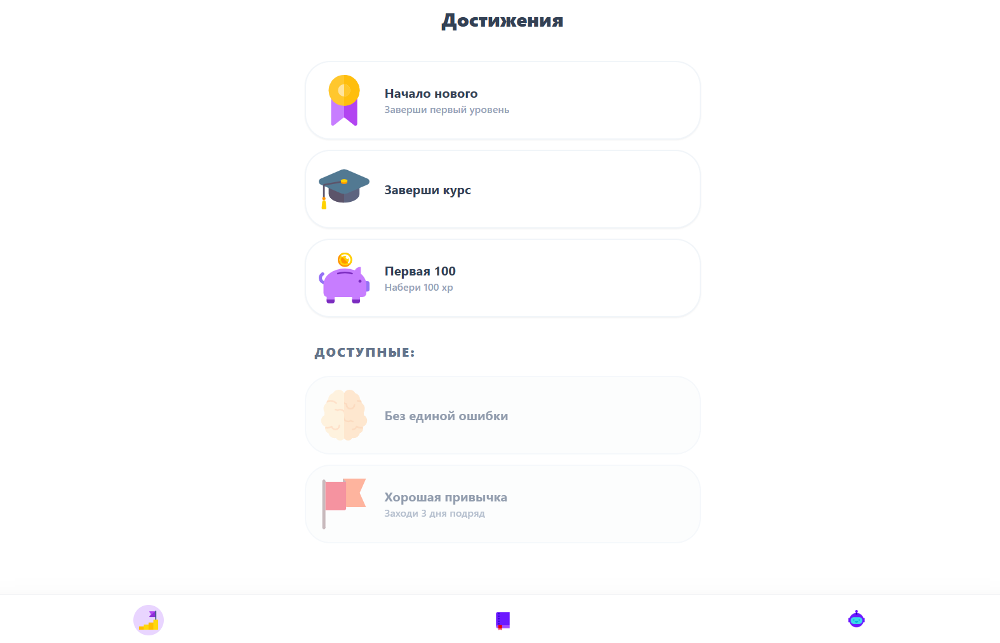
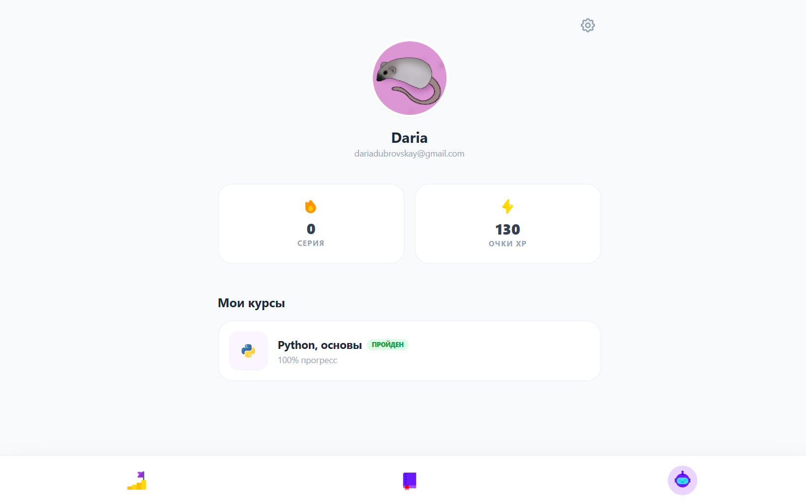
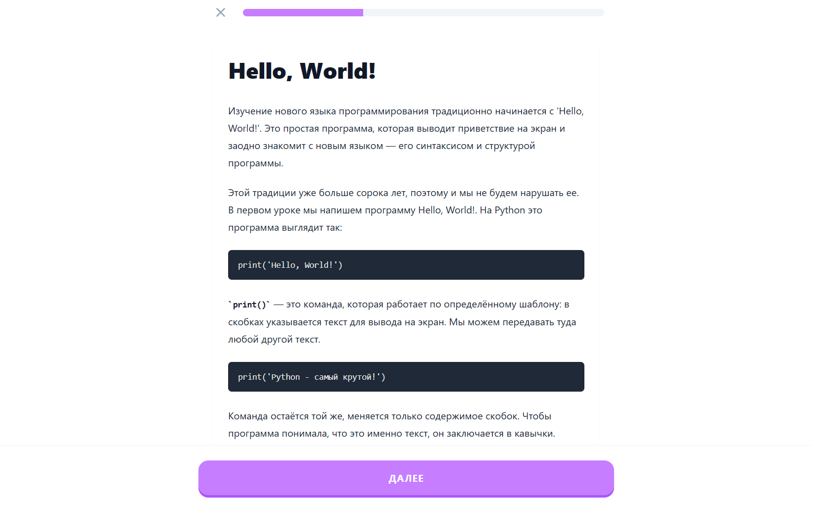
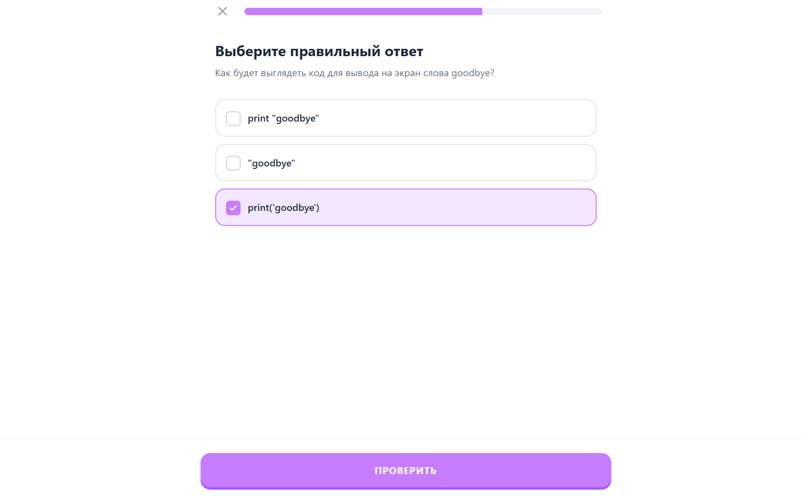
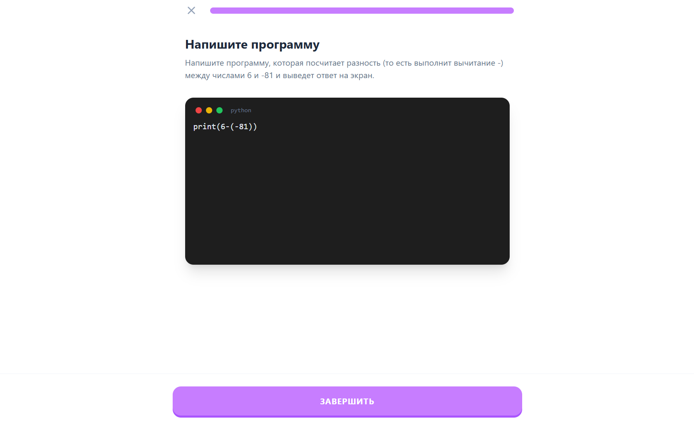

# 🚀 Code-Lingo Frontend

Интерактивная платформа для обучения программированию с элементами геймификации. Фронтенд построен на легком и быстром стеке, обеспечивающем мгновенную реакцию интерфейса.

## ✨ Основные возможности

* **Интерактивные уроки:** Поддержка теории в формате Markdown.
* **Разнообразные задачи:**
    * `Choice` — выбор правильных вариантов.
    * `Gap` — заполнение пропусков в коде.
    * `Code` — полноценный редактор кода с проверкой решений на бэкенде.
* **Геймификация:** Система достижений (модальные окна), подсчет XP и стрик (ударный режим).
* **Умная авторизация:** Автоматическое определение режима (вход/регистрация) через URL-параметры.
* **Адаптивность:** Полная поддержка мобильных устройств.

## 🛠 Технологический стек

* **Alpine.js** — реактивность и логика компонентов.
* **Tailwind CSS** — стилизация и анимации.
* **Marked.js** — рендеринг теории из Markdown.

---

## 📸 Скриншоты интерфейса

    
    
    
    
    
    
    

---

## 🚀 Быстрый старт

1. Склонируйте репозиторий.
2. Откройте `index.html` в браузере (или используйте Live Server в VS Code).
3. Убедитесь, что бэкенд запущен по адресу `http://localhost:8000`.